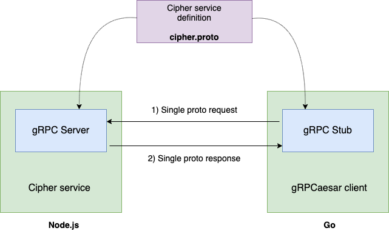

# 🗡️gRPCaesar Microservice🗡️

## Overview

gRPCaesar is a microservice built with gRPC. It has two components:

1. **gRPCaesar client**: Written in Go, the client accepts input from command-line flags and makes a request to the Cipher service with that input.
2. **Cipher service**: Written in Node.js, the service encodes or decodes the received text using the [Caesar cipher encryption technique](https://en.wikipedia.org/wiki/Caesar_cipher).

## Service Description

The Cipher service interface defined in the cipher.proto file includes one simple RPC service method: ProcessMessage. 

This method accepts a request consisting of a string text, an integer shift, and a boolean denoting encryption or decryption. It return a response consisting of a string message.



## Setting flag values

| Flag       | Description   | Value    | Default Value |
| ------------- |-------------|-------------|-------------|
| ```-t``` | text, a quote-enclosed string | ```"Et tu brute"```| ```"hello world"```
| ```-s``` | shift, an integer | ```3``` | ```0``` |
| ```-m``` | mode, a string character "e" or "d" (encode or decode) | ```e``` | ```e``` |


For example:
```bash
./grpcaesar -t "Et tu brute" -s 3 -m e
```

## Quickstart

**Start server**

```bash
cd service
npm install
node server.js
```

**Start client**

```bash
cd client
./grpcaesar -t "hi" -s 2 -m e    #encode "hi" with a shift of 2
./grpcaesar -t "jk" -s 2 -m d    #decode "jk" with a shift of 2
```

**Rebuild the Go client executable**

```bash
cd client
go build -o grpcaesar
```

**Run the Go code without executable**

```bash
cd client
go run main.go cipher.pb.go -t "hi" -s 2 -m e   #encode "hi" with a shift of 2
```

**Run Go unit tests**
```bash
cd client
go test
```

### Learn more

For more information on gRPC with Node.js and Go, see [the official gRPC documentation](https://grpc.io/docs/).
